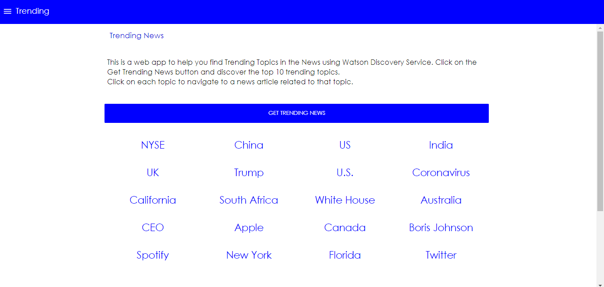
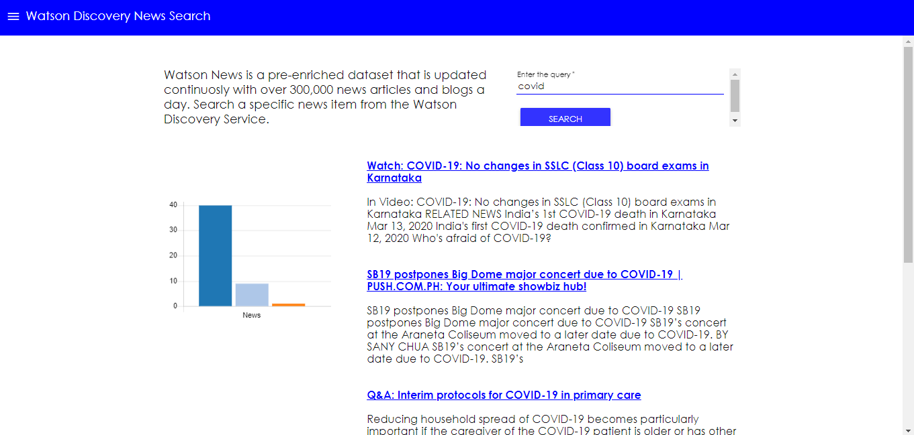
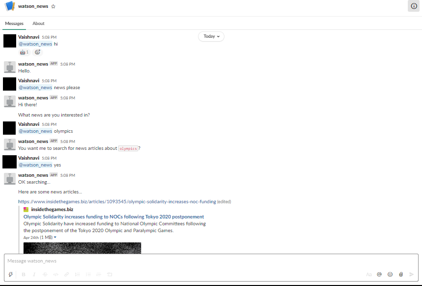
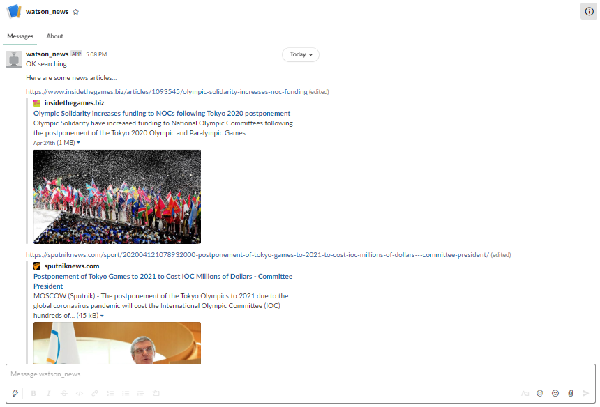

# AI Powered News Search App (Level-1)

## Description

The web is home to massive amounts of data, with more being created every day. Organizations can harness this constant stream of information to gain understanding, plan strategies, and find opportunities. Enriched news data can help to make dynamic connections across current events faster.
The AI Powered News Search App is a web application that acts as a simple user interface that integrates with the IBM Watson Discovery Service and demonstrates two use cases using Watson Discovery News:

* **Search**: Query for the most relevant new articles about a specific topic or subject. Because the news collection is pre-enriched with natural language processing, you can query not just on keywords or categories but also on concepts, sentiment, and relations to get richer search responses.

* **Trending topics in the news**: Identify popular topics over the past 24 hours. Topics can be general, or specific to an industry or category.

* **Slack Integration**: This also app can be integrated with the slack interface through a bot. Thus, the user can directly query the Watson Discovery News without using the Web application from the Slack app itself.

## Flow

1. The user interacts with the Watson Discovery News Server via the app UI.
2. User input is processed and routed to the Watson Discovery News Server.
3. The Watson Discovery News Server sends user requests to the Watson Discovery Service.
4. The Watson Discovery Service queries the Watson News Collection.
5. The Watson Discovery Service sends news articles to the RSS Reader.
6. The Watson Discovery Service responds to Slack search requests.

## Sample Output

The trending page:

 

The query page:

 

The slack integration:

 

